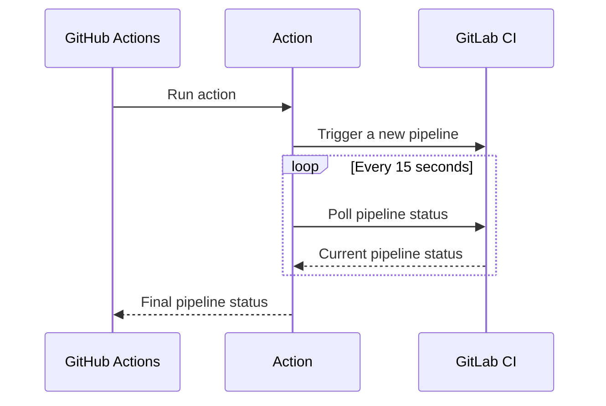

# GitLab Pipeline trigger action

[GitHub](https://github.com/digital-blueprint/gitlab-pipeline-trigger-action) |
[GitHub Marketplace](https://github.com/marketplace/actions/gitlab-pipeline-trigger)

[](https://github.com/digital-blueprint/gitlab-pipeline-trigger-action/actions/workflows/main.yml)

This GitHub action triggers and waits for a [GitLab pipeline](https://docs.gitlab.com/ee/ci/pipelines/) to complete.

You can for example use this action in your GitHub workflow to trigger a deployment pipeline on a private
GitLab server after a successful build pipeline and wait for the deployment (with possible End2End tests)
to finish, so you would get a notification if the deployment failed.



## Inputs

### `host`

The GitLab host to trigger the pipeline on. Default `gitlab.com`.

### `id`

**Required** The ID or path of the project owned by the authenticated user.
You will find the *Project ID* in the *General Settings* of your GitLab project.

### `ref`

**Required** The branch or tag to run the pipeline on.

### `trigger_token`

**Required** The [GitLab pipeline trigger token](https://docs.gitlab.com/ee/ci/triggers/index.html#create-a-trigger-token)
to trigger the pipeline.

### `access_token`

The [GitLab pipeline access token](https://docs.gitlab.com/ee/user/project/settings/project_access_tokens.html)
to access the pipeline via the API. You need the `read_api` and `read_repository` scopes with `Guest` role for this token.

For public projects you don't need to provide an access token.

### `variables`

A map of key-valued strings containing the pipeline variables. For example: `{ VAR1: "value1", VAR2: "value2" }`.. Default `"World"`.

## Outputs

### `status`

The last status of the pipeline. See [GitLab project pipelines](https://docs.gitlab.com/ee/api/pipelines.html#list-project-pipelines)
for more information about which status values there are.

## Example usage

```yaml
uses: digital-blueprint/gitlab-pipeline-trigger-action@v1
with:
  host: 'gitlab.example.com'
  trigger_token: ${{ secrets.DEPLOY_TRIGGER_TOKEN }}
  access_token: ${{ secrets.DEPLOY_ACCESS_TOKEN }}
  id: '123'
  ref: 'main'
  variables: '{"VAR1":"value1","VAR2":"value2"}'
```
