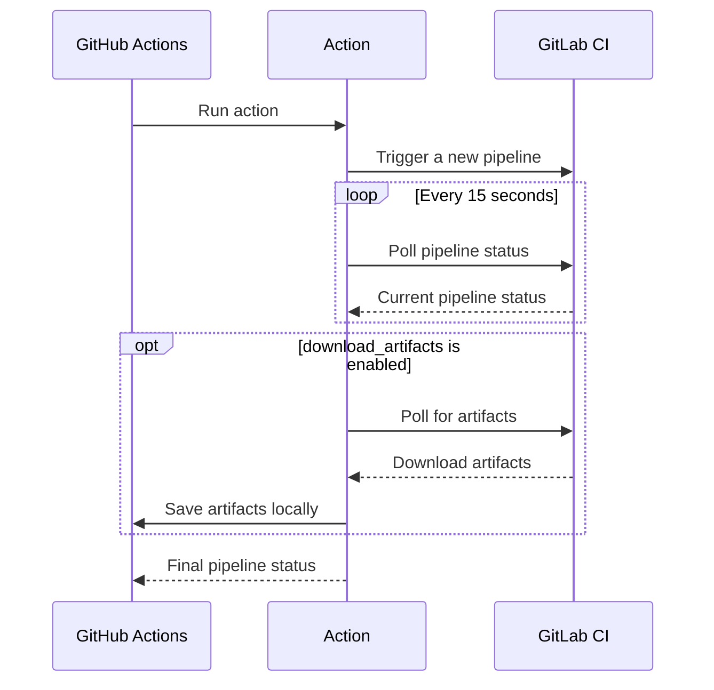

# GitLab Pipeline trigger action

[GitHub](https://github.com/digital-blueprint/gitlab-pipeline-trigger-action) |
[GitHub Marketplace](https://github.com/marketplace/actions/gitlab-pipeline-trigger)

[](https://github.com/digital-blueprint/gitlab-pipeline-trigger-action/actions/workflows/main.yml)

This GitHub action triggers and waits for a [GitLab pipeline](https://docs.gitlab.com/ee/ci/pipelines/) to complete.

You can for example use this action in your GitHub workflow to trigger a deployment pipeline on a private
GitLab server after a successful build pipeline and wait for the deployment (with possible End2End tests)
to finish, so you would get a notification if the deployment failed.



## Inputs

### `host`

The GitLab host to trigger the pipeline on. Default `gitlab.com`.

### `id`

**Required** The ID or path of the project owned by the authenticated user.
You will find the _Project ID_ in the _General Settings_ of your GitLab project.

### `ref`

**Required** The branch or tag to run the pipeline on.

### `trigger_token`

**Required** The [GitLab pipeline trigger token](https://docs.gitlab.com/ee/ci/triggers/index.html#create-a-trigger-token)
to trigger the pipeline.

### `access_token`

The [GitLab pipeline access token](https://docs.gitlab.com/ee/user/project/settings/project_access_tokens.html)
to access the pipeline via the API. You need the `read_api` and `read_repository` scopes with `Reporter` role for this token.

For public projects you don't need to provide an access token.

**Note:** Required when `download_artifacts` is enabled.

### `variables`

A map of key-valued strings containing the pipeline variables. For example: `{ VAR1: "value1", VAR2: "value2" }`. The value has to be valid JSON. If not set the default is `{}`.

### `download_artifacts`

Whether to download artifacts generated by the pipeline. Default `false`.

**Note:** Requires `access_token` to be set.

### `download_artifacts_on_failure`

Whether to download artifacts even when the pipeline fails. Default `true`.

**Note:** Requires both `access_token` and `download_artifacts` to be enabled.

### `fail_if_no_artifacts`

Whether to fail the action if no artifacts are found. Default `false`.

**Note:** Requires `download_artifacts` to be enabled. Useful for ensuring pipelines generate expected artifacts.

### `download_job_logs`

Whether to download job console output. Default `false`.

**Note:** Requires `access_token` to be set. Downloads console output from all pipeline jobs independently of artifacts.

### `download_path`

Path where to save downloaded artifacts and logs. Defaults to `./downloads`.

### `verbose`

Whether to enable verbose logging. When disabled, only generic messages are shown without
potentially sensitive information like URLs, IDs, or names. Default `false`.

## Outputs

### `status`

The last status of the pipeline. See [GitLab project pipelines](https://docs.gitlab.com/ee/api/pipelines.html#list-project-pipelines)
for more information about which status values there are.

### `web_url`

The URL of the pipeline, for example `https://gitlab.com/foo/bar/pipelines/47`.

### `artifacts_downloaded`

Whether artifacts were successfully downloaded. Only set when `download_artifacts` is enabled.

## Example usage

### Basic usage

```yaml
uses: digital-blueprint/gitlab-pipeline-trigger-action@v1
with:
  host: "gitlab.example.com"
  trigger_token: ${{ secrets.DEPLOY_TRIGGER_TOKEN }}
  access_token: ${{ secrets.DEPLOY_ACCESS_TOKEN }}
  id: "123"
  ref: "main"
  variables: '{"VAR1":"value1","VAR2":"value2"}'
```

### With artifact downloading

```yaml
uses: digital-blueprint/gitlab-pipeline-trigger-action@v1
with:
  host: "gitlab.example.com"
  trigger_token: ${{ secrets.DEPLOY_TRIGGER_TOKEN }}
  access_token: ${{ secrets.DEPLOY_ACCESS_TOKEN }}
  id: "123"
  ref: "main"
  variables: '{"VAR1":"value1","VAR2":"value2"}'
  download_artifacts: "true"
  download_path: "./build-artifacts"
```

### With job logs

```yaml
uses: digital-blueprint/gitlab-pipeline-trigger-action@v1
with:
  host: "gitlab.example.com"
  trigger_token: ${{ secrets.DEPLOY_TRIGGER_TOKEN }}
  access_token: ${{ secrets.DEPLOY_ACCESS_TOKEN }}
  id: "123"
  ref: "main"
  variables: '{"VAR1":"value1","VAR2":"value2"}'
  download_job_logs: "true"
  download_path: "./pipeline-logs"
```

## Downloading artifacts and job logs

When `download_artifacts` is enabled and `access_token` is provided, the action will download artifacts based on the pipeline status:

- **Pipeline succeeds**: Artifacts are downloaded automatically.
- **Pipeline fails**: The artifacts are downloaded if `download_artifacts_on_failure` is enabled. Default `true`.

**Artifact Validation:**

- If `fail_if_no_artifacts` is enabled, the action will fail if no artifacts are found.
- This helps ensure pipelines generate expected outputs and catch configuration issues early.

**Job Logs:**

- If `download_job_logs` is enabled, console output from all jobs will be downloaded.
- Logs are saved as `job.log` files in each job's directory.
- This provides complete visibility into pipeline execution for debugging.
- Job log downloading is independent of artifact downloading.

The action will:

1. Fetch all jobs from the completed pipeline;
2. Identify jobs that have artifacts;
3. Download artifacts from each job if `download_artifacts` is enabled;
4. Extract the artifacts to the specified `download_path`;
5. Organize artifacts by job (each job gets its own subdirectory);
6. Download job console logs if `download_job_logs` is enabled;
7. Save logs as `job.log` files in each job's directory.

The artifacts and logs are organized as follows:

```
download_path/
├── job_123_job_name_1/
│   ├── artifact1.txt    # Artifacts (if download_artifacts enabled)
│   ├── artifact2.txt    # Artifacts (if download_artifacts enabled)
│   └── job.log          # Console output (if download_job_logs enabled)
├── job_124_job_name_2/
│   ├── build/           # Artifacts (if download_artifacts enabled)
│   ├── dist/            # Artifacts (if download_artifacts enabled)
│   └── job.log          # Console output (if download_job_logs enabled)
└── ...
```
